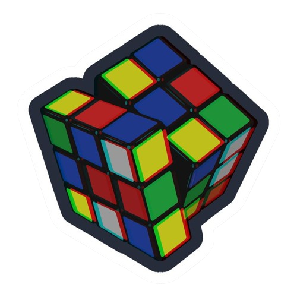
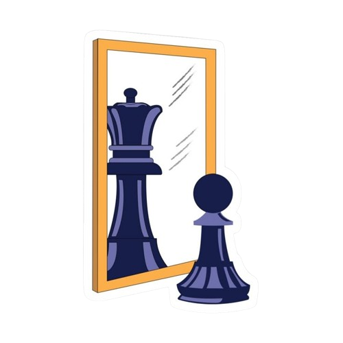

tech: 
    

     

starting in the data area, learning new skills, passionate about research and obsessed with organization!

⏔⏔⏔⏔⏔⏔ ꒰ ᧔ෆ᧓ ꒱ ⏔⏔⏔⏔⏔⏔ ꒰ ᧔ෆ᧓ ꒱ ⏔⏔⏔⏔⏔⏔ ꒰ ᧔ෆ᧓ ꒱ ⏔⏔⏔⏔⏔⏔ ꒰ ᧔ෆ᧓ ꒱ ⏔⏔⏔⏔⏔⏔ ꒰ ᧔ෆ᧓ ꒱ ⏔⏔⏔⏔⏔⏔
